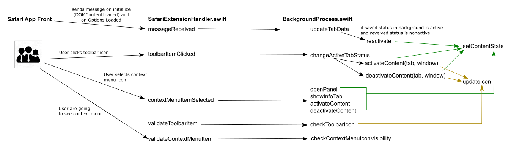

# Alpheios Safari App Extension - background part

The project consists of the following folders:
- **AlpheiosV2.xcodeproj** - the folder with XCode project files
- **AlpheiosV2** - the folder with application files (I didn't touch it at all, it has only default template data)
- **AlpheiosSafariV2** - the folder with safari app extension files (here it is all my work)
- **dist** - **.app** built and **.dmg** build

## AlpheiosSafariV2 files

### Info.plist

[About Safari App Extension Default Keys](https://developer.apple.com/documentation/safariservices/safari_app_extensions/safari_app_extension_info_property_list_keys/about_safari_app_extension_default_keys)

This file consists of properties for the app extension.
I am using these keys in the **NSExtension** section:

Name | Description
------------ | -------------
SFSafariContextMenu | It contains the data for each context item that could appear using app extension. 
SFSafariStyleSheet | It contains the name for the stylesheet from safari-app-front. 
SFSafariContentScript | It contains the name for the js script from safari-app-front. 
SFSafariToolbarItem | It contains the data for toolbaritem.
SFSafariWebsiteAccess | It is for defining the access from tabs (I am using simply full access - didn't dive into it here).

### script.js, script.map.js, style.css

It is compiled data from [safari-app-front repo](https://github.com/alpheios-project/safari-app-front)

### SafariExtensionHandler.swift ([apple doc](https://developer.apple.com/documentation/safariservices/sfsafariextensionhandler))

The main file in Safari app extension structure.
There are all events comming from js part here.

Name | Description
------------ | -------------
messageReceived | This event executes on getting message from the injected js file.
toolbarItemClicked | This event is from toolbar icon clicked.
contextMenuItemSelected | This event is from context menu item selected.
validateToolbarItem | This event executes any time when the state of the toolbar icon could be changed.
validateContextMenuItem | This event executes before context menu becomes visible.
backgroundProcess | this is the variable for all alpheios custom background process (similiar to webextension background processes)

### BackgroundProcess.swift

This is the main file for all background process similiar to the webextension version

Name | Description
------------ | -------------
browserIcons | This is the dictionary with browser icons (name: image).
tabs | This is the dictionary with tabs data registered in the extension (hashValue: TabScript object).
updateIcon | It changes icon for the toolbar
getTabFromTabsByHash | It creates a new tab in tabs dictionary or extracts the exists by hashValue
setContentState | It sends the stateRequestMessage to the js file
activateContent (with window in params) | It defines the current activePage from window, sends the state to the front and sets icon to active. It is used from changeActiveTabStatus.
activateContent (without window in params) | It defines the current activePage from window, changes the state of the tab to the active and sends the state to the front. It is used from contextMenuItemSelected.
deactivateContent (with window in params) | It defines the current activePage from window, sends the state to the front and sets icon to nonactive. It is used from changeActiveTabStatus.
deactivateContent (without window in params) | It defines the current activePage from window, changes the state of the tab to the nonactive  and sends the state to the front. It is used from contextMenuItemSelected
openPanel | it changes the state of the panel in the current tab and sends the state to the front. It is used from changeActiveTabStatus.
showInfo | it checks the state of the panel in the current tab (changes it if needed), changes the tab and sends the state to the front. It is used from changeActiveTabStatus.
changeActiveTabStatus | It changes the state of the current tab to the opposite. Used from toolbarItemClicked.
updateTabData | It overchecks the data for the current tab, defines if it needed to be reactivated or simply updated.
reactivate | Sends the current saved state from the background to front.
checkToolbarIcon | Updates the toolbar icon (is used on reloading a page)
checkContextMenuIconVisibility | Checks the visibility of all context menu items according to the tab state

### TabScript.swift

This is the class object for saving data about the tab.

### Message.swift, RequestMessage.swift, StateRequest.swift

This is the class objects for converting data to message.

## Developer info

### Running an app extension from Xcode
1. Open the Xcode project files. Those files are located in a directory with a `.xcodeproj` extension.
2. Select an active scheme to use. A scheme selector is located near a run button in a toolbar. Please read more on 
schemes below.
2. Run the build.
3. Open a Safari browser.
4. Check **Allow Unsigned Extensions** in a **Develop** menu.
5. Go to **Preferences** -> **Extensions** and check a box against an extension name.
6. Reload the page. Safari app extension should be fully functional at this moment.

### Schema selection for running an extension
Safari app extension is stored within a hosting macOS app. So the one way to run it is to run a corresponding
macOS app. For this, choose an **AlpheiosV2** app schema marked with a stylized letter **A** (meaning application).

The other way is to run a Safari app extension directly. For this, an **AlpheiosSafariV2** schema shall be used.
It is marked with a blue letter **E** (meaning extension) inside a white circle. It will ask what app
should it run. Choose **Safari** from the list of apps offered. An instance of Safari web browser will
open. In the browser, allow unsigned extensions and activate an Alpheios extension by checking a box
next to its name as described in **How to run from XCode** section.

Using an app extension schema to run an extension will allow to attach debugger to a running extension and monitor it in
real time.

### Troubleshooting

#### Running a Safari App Extension within a macOS app
If Safari does not see an app extension, try to clean a build directory (**Product**->**Clean Build Folder**) 
and run **Build** again.

#### Running a Safari App Extension Directly
If Safari does not see an app extension or it fails in some other way, close Safari, restart XCode
and repeat all steps from the beginning.